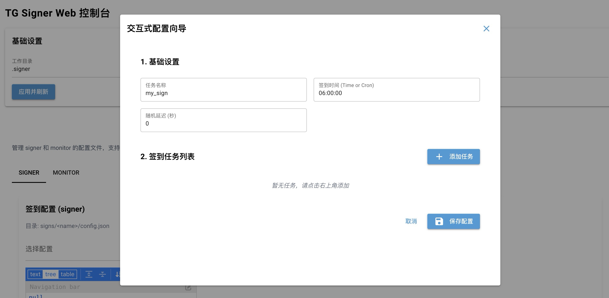

# TG Signer

[English](./README_EN.md)

一个用于 Telegram 自动签到、消息发送、消息监控、自动回复和 WebUI 管理的开源项目。

项目支持两种使用方式：

- 命令行：适合熟悉 CLI、希望批量操作或脚本化部署的用户
- WebUI：适合希望在网页里完成登录、运行配置、即时操作和日志查看的用户



## 功能概览

- Telegram 账号登录与 session 管理
- 自动签到任务配置与定时执行
- 群组、频道、私聊消息监控
- 关键词自动回复、转发与通知
- 即时发送文本、Dice、查看成员、配置 Telegram 定时消息
- WebUI 中直接管理登录、运行配置、配置文件、用户缓存、记录和日志
- 可选接入 LLM 处理图片识别、计算题回复等 AI 相关动作
- 支持 Docker 部署 WebUI

## 安装方式

### 1. 从 PyPI 安装

只使用命令行：

```bash
pip install -U tg-signer
```

需要 WebUI：

```bash
pip install -U "tg-signer[gui]"
```

希望启用 `tgcrypto` 加速：

```bash
pip install -U "tg-signer[gui,speedup]"
```

### 2. 从源码安装

```bash
git clone <your-repo-url>
cd tg-signer
python -m venv .venv
source .venv/bin/activate
pip install -U pip
pip install -e ".[gui,speedup]"
```

Windows `cmd`：

```cmd
py -3.11 -m venv .venv
.\.venv\Scripts\activate.bat
pip install -U pip
pip install -e ".[gui,speedup]"
```

## 快速开始

### 1. 登录 Telegram 账号

```bash
tg-signer login
```

按提示输入手机号、验证码和二步验证密码。登录成功后会生成对应的 session 文件，并同步最近聊天列表。

### 2. 创建或编辑签到配置

```bash
tg-signer run my_sign
```

如果 `my_sign` 不存在，会根据交互式提示创建配置。之后的配置文件会保存到：

```text
.signer/signs/my_sign/config.json
```

### 3. 运行签到

```bash
tg-signer run my_sign
```

只执行一次：

```bash
tg-signer run-once my_sign
```

### 4. 运行监控

```bash
tg-signer monitor run my_monitor
```

### 5. 启动 WebUI

本地访问：

```bash
tg-signer webgui -H 127.0.0.1 -P 8080
```

服务器部署：

```bash
tg-signer webgui -H 0.0.0.0 -P 8080 --auth-code your-access-code
```

## WebUI 页面说明

当前 WebUI 主要包含这些页面：

- `登录`：账号选择、session 目录、代理、发送验证码、提交验证码、二步验证、退出登录
- `运行配置`：选择账号，配置该账号需要保活运行哪些 signer / monitor 配置，并查看后台任务
- `即时操作`：选择发送账号，发送文本、Dice、查看成员、管理 Telegram 定时消息
- `LLM配置`：配置 OpenAI 兼容接口，供 AI 相关动作使用
- `配置`：管理 signer / monitor 配置
- `用户`：查看缓存的用户信息与 recent chats
- `记录`：查看签到记录
- `日志`：查看日志文件与运行日志

说明：

- LLM 是可选的。未配置时，普通签到、监控和即时消息功能仍然可用
- 只有涉及图片识别、计算题回复等 AI 能力时才需要配置 LLM

详细说明见：

- [CLI 使用文档](./docs/CLI.md)
- [WebUI 使用文档](./docs/WEBUI.md)
- [Docker 部署文档](./DOCKER_DEPLOY.md)

## 常用命令

```bash
tg-signer login
tg-signer run my_sign
tg-signer run-once my_sign
tg-signer monitor run my_monitor
tg-signer send-text me hello
tg-signer send-dice me
tg-signer list-members --chat_id -1001234567890 --admin
tg-signer schedule-messages --crontab "0 9 * * *" --next-times 5 -- me good morning
tg-signer webgui -H 0.0.0.0 -P 8080 --auth-code your-access-code
```

## 目录结构

默认工作目录为 `.signer`，其中常见结构如下：

```text
.signer/
  signs/
    my_sign/
      config.json
      <user_id>/
        sign_record.json
  monitors/
    my_monitor/
      config.json
  users/
    <user_id>/
      me.json
      latest_chats.json
  webui_keepalive.json
```

说明：

- `signs/`：签到配置
- `monitors/`：监控配置
- `users/`：登录后缓存的用户和最近聊天信息
- `webui_keepalive.json`：WebUI 保存的保活运行配置

## Docker 部署

仓库根目录已经提供可直接用于服务器部署的：

- [Dockerfile](./Dockerfile)
- [docker-compose.yml](./docker-compose.yml)
- [.env.example](./.env.example)
- [DOCKER_DEPLOY.md](./DOCKER_DEPLOY.md)

最快启动方式：

```bash
cp .env.example .env
docker compose up -d --build
```

## 常见问题

### 1. `PEER_ID_INVALID` 是什么

这通常不是程序崩了，而是当前账号还没有“见过”这个目标会话。常见解决方式：

- 先在 Telegram 客户端里用这个账号打开过该用户、群组或频道
- 使用 `@username` 而不是裸数字 ID
- 先给 `me` 发送测试消息，确认登录和发送逻辑没问题

### 2. LLM 必须配置吗

不是。只有 AI 相关动作才依赖 LLM。普通签到、监控、即时发消息都可以不配置。

### 3. 发布到公开仓库前要注意什么

不要提交这些内容：

- `.signer/`
- `*.session`
- `*.session_string`
- `data/`
- `logs/`
- `.env`

这些路径已经在 `.gitignore` 中忽略。

## 贡献

欢迎 Issue、PR 和改进建议。

- [贡献指南](./CONTRIBUTING.md)
- [安全说明](./SECURITY.md)

## 许可证

本项目基于 [BSD-3-Clause](./LICENSE) 开源。
